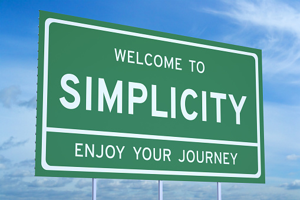

       
&nbsp;&nbsp;[home](http://tiny.cc/silon#top) ::
[src](https://github.com/timm/silon/raw/master/src) ::
[issues](http://tiny.cc/silon) ::
<a href="https://github.com/timm/silon/raw/master/raw/master/LICENSE.md">&copy; 2020</a>, Tim Menzies <<a href="mailto:timm@ieee.org">timm&commat;ieee.org</a>>
   

# Silon

Cluster + contrast + dominate + optimize 

Less is more.   
-- Dieter Rams

Simplex sigillum veri
(Simplicity is the sign of truth.)  
-- Hermann Boerhaave

Small needs lead to a large life.   
-- Unknown

Simplicity is prerequisite for reliability.  
— Edsger W. Dijkstra

My greatest skill has been to want little.    
-- Henry David Thoreau

Simplicity is the ultimate sophistication.  
-- Leonardo da Vinci

The art of simplicity is a puzzle of complexity.  
-- Doug Horton

Nature is pleased with simplicity. And nature is no dummy.   
-- Isaac Newton

It is vain to do with more what can be done with less.   
-- William Of Occam

The art of being wise is the art of knowing what to overlook.   
-- William James

Simplicity boils down to two steps: Identify the essential. Eliminate the rest.   
-- Leo Babauta 

Strive for design simplicity. You never have to fix anything you leave out.   
-- William P. Lear

Technical skill is mastery of complexity while creativity is mastery of simplicity.  
--  Sir Erik Christopher Zeeman

It is always the nearest, plainest and simplest principles that learned men comprehend last.  
-- Elbert (Green) Hubbard

Truth is ever to be found in simplicity, and not in the multiplicity and confusion of things.  
-- Sir Isaac Newton

The more you have, the more you are occupied. The less you have, the more free you are.  
-- Mother Teresa

Give me the fruitful error any time, full of seeds, bursting with its own corrections. You can keep your sterile truth for yourself.    
--  Vilfredo Pareto

In my view, aiming at simplicity and lucidity is a moral duty of all intellectuals: lack of clarity is a sin, and pretentiousness is a crime.  
--  Karl Raimund Popper

Any intelligent fool can make things bigger, more complex, and more violent. It takes a touch of genius — and a lot of courage to move in the opposite direction.   
-- Ernst F. Schumacher

Il faut bien s'arrêter quelque part, et pour que la science soit possible, il faut s'arrêter quand on a trouvé la simplicité
(Analyse data just so far as to obtain simplicity and no further.)   
-- A.D. Ritchue

Ccomplexity and precision bear an inverse relation to one another in the sense that, as the complexity of a problem increases, the possibility of analysing it in precise terms diminishes.  
-- Lofti Zadeh 

