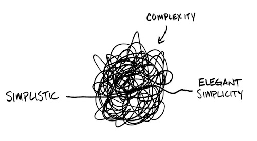

       
&nbsp;[home](http://git.io/silon) ::
[src](https://github.com/timm/silon/raw/master/src) ::
[issues](http://git.io/silon) ::
<a href="https://github.com/timm/silon/raw/master/raw/master/LICENSE.md">&copy; 2020</a>,
Tim Menzies
<<a href="mailto:timm@ieee.org">timm&commat;ieee.org</a>>
 
 

# Silon

Cluster + contrast + dominate + optimize 

The beauty of small and simple code is that you can bend or break the rules as long it stays small and simple. Rules allow people to write code without thinking. [And when] you don't think […] you get bloated code that just concatenates stupid patterns.
People stop thinking and questioning [and] then its just worshipping some rules without any pruporse.   
-- Cinap Lenrek

Increasingly, people seem to misinterpret complexity as sophistication, which is baffling—the incomprehensible should cause suspicion rather than admiration. Possibly this trend results from a mistaken belief that using a somewhat mysterious device confers an aura of power on the user.    
-- Niklaus Wirth

Il faut bien s'arrêter quelque part, et pour que la science soit possible, il faut s'arrêter quand on a trouvé la simplicité
(You have to stop somewhere, and for science to be possible, you have to stop when you find simplicity).  
-- A.D. Ritchue

Are you quite sure that all those bells and whistles, all those wonderful facilities of your so called powerful programming languages, belong to the solution set rather than the problem set?   
--  Edsger W. Dijkstra

Complexity and precision bear an inverse relation to one another in the sense that, as the complexity of a problem increases, the possibility of analysing it in precise terms diminishes.  
-- Lofti Zadeh 

Any intelligent fool can make things bigger, more complex, and more violent. It takes a touch of genius — and a lot of courage to move in the opposite direction.   
-- Ernst F. Schumacher

In my view, aiming at simplicity and lucidity is a moral duty of all intellectuals: lack of clarity is a sin, and pretentiousness is a crime.  
--  Karl Raimund Popper

In software, the most beautiful code, the most beautiful functions, and the most beautiful programs are sometimes not there at all.   
-- Jon Bentley

The computing scientist’s main challenge is not to get confused by the complexities of his own making.
--  E. W. Dijkstra

It is always the nearest, plainest and simplest principles that learned men comprehend last.  
-- Elbert (Green) Hubbard

The ability to simplify means to eliminate the unnecessary so that the necessary may speak.   
-- Hans Hoffmann

Truth is ever to be found in simplicity, and not in the multiplicity and confusion of things.  
-- Sir Isaac Newton

A (system) that doesn’t have everything is actually easier to (use) in than some that do.    
-- Dennis M. Ritchie

The more you have, the more you are occupied. The less you have, the more free you are.  
-- Mother Teresa

Technical skill is mastery of complexity while creativity is mastery of simplicity.  
--  Sir Erik Christopher Zeeman

The cheapest, fastest, and most reliable components are those that aren’t there.   
-- Gordon Bell

Simplicity boils down to two steps: Identify the essential. Eliminate the rest.   
-- Leo Babauta 

Simplicity – the art of maximizing the amount of work not done – is essential.  
-- From the Agile Manifesto.

Strive for design simplicity. You never have to fix anything you leave out.   
-- William P. Lear

The whole point of getting things done is knowing what to leave undone.  
-- Oswald Chambers

One of my most productive days was throwing away 1000 lines of code.    
-- Ken Thompson

Complexity has nothing to do with intelligence, simplicity does.  
-- Larry Bossidy

The art of being wise is the art of knowing what to overlook.   
-- William James

Nature is pleased with simplicity. And nature is no dummy.   
-- Isaac Newton

It is vain to do with more what can be done with less.   
-- William Of Occam

Simplicity carried to the extreme becomes elegance.  
-- Jon Franklin

The art of simplicity is a puzzle of complexity.  
-- Doug Horton

The central enemy of reliability is complexity.   
-- Geer et al.

Simplicity is the ultimate sophistication.  
-- Leonardo da Vinci

My greatest skill has been to want little.    
-- Henry David Thoreau

Simplicity is prerequisite for reliability.  
— Edsger W. Dijkstra

Small needs lead to a large life.   
-- Unknown

Simplex sigillum veri   
(Simplicity is the sign of truth.)  
-- Hermann Boerhaave

Less is more.   
-- Dieter Rams

less, plz.    
-- Tim Menzies
